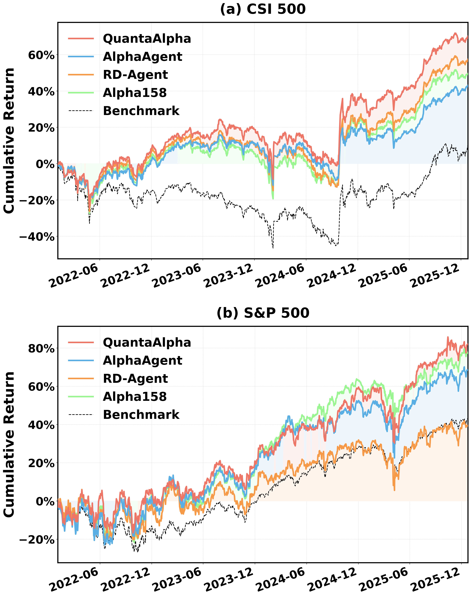
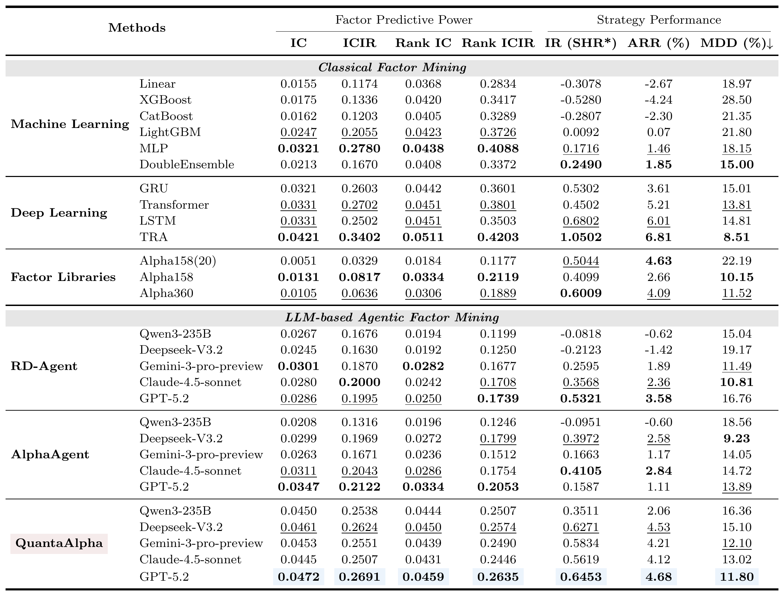
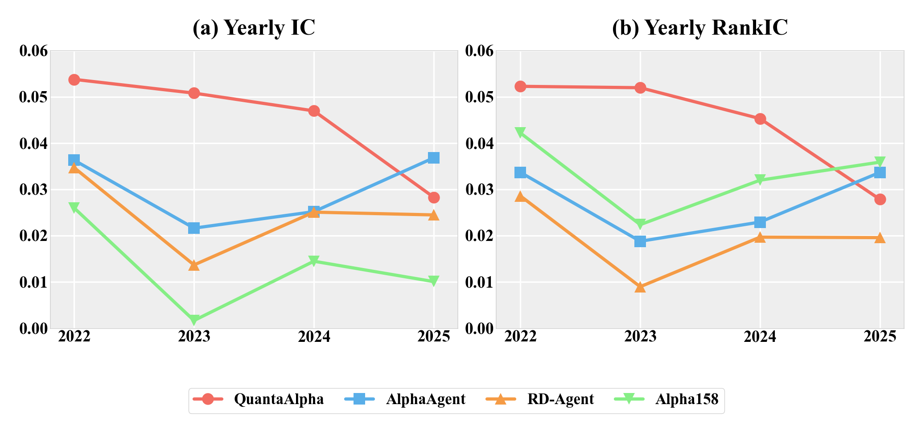
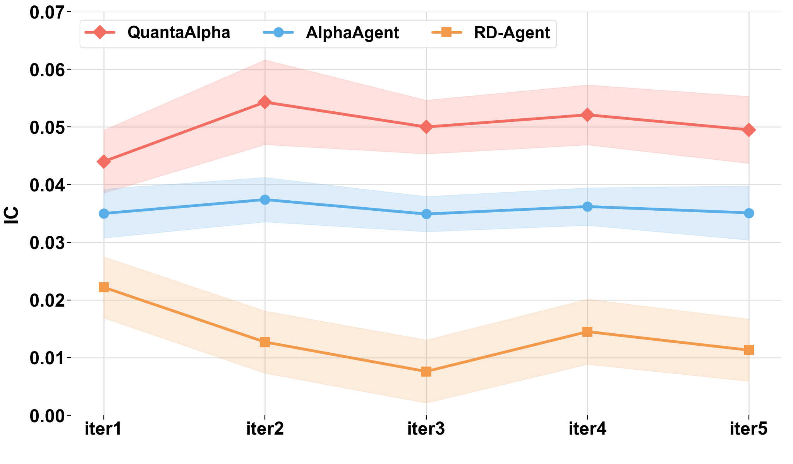

<div align="center">
  
</div>

<div align="center">

  <h1 align="center" style="color: #2196F3; font-size: 32px; font-weight: 700; margin: 20px 0; line-height: 1.4;">
    🌟 QuantaAlpha: <span style="color: #555; font-weight: 400; font-size: 20px;"><em>LLM 驱动的自进化因子挖掘框架</em></span>
  </h1>

  <p align="center" style="font-size: 14px; color: #888; max-width: 700px; margin: 10px auto;">
    🧬 <em>基于轨迹的自进化范式，通过多样化规划初始化、轨迹级进化和结构化假设-代码约束，实现卓越的量化 Alpha 因子挖掘</em>
  </p>

  <p style="margin: 20px 0;">
    <a href="https://arxiv.org/abs/2602.07085"></a>
    <a href="#"></a>
    <a href="#"></a>
    <a href="https://github.com/QuantaAlpha/QuantaAlpha"></a>
  </p>

  <p style="font-size: 16px; color: #666; margin: 15px 0; font-weight: 500;">
    🌐 <a href="README.md" style="text-decoration: none; color: #0066cc;">English</a> | <a href="README_CN.md" style="text-decoration: none; color: #0066cc;">中文</a>
  </p>

</div>

<div align="center" style="margin: 30px 0;">
  <a href="#quick-start" style="text-decoration: none; margin: 0 4px;">
    
  </a>
  <a href="#web-ui" style="text-decoration: none; margin: 0 4px;">
    
  </a>
  <a href="docs/user_guide.md" style="text-decoration: none; margin: 0 4px;">
    
  </a>
  <a href="experiment/README_EXPERIMENT_CN.md" style="text-decoration: none; margin: 0 4px;">
    
  </a>
</div>

---

## 🎯 概述

**QuantaAlpha** 将大语言模型（LLM）与进化策略结合，通过自进化轨迹自动完成量化 Alpha 因子的挖掘、进化与验证。你只需输入研究方向，其余流程将自动运行。

<p align="center">💬 研究方向 → 🧩 多样化规划 → 🔄 轨迹进化 → ✅ 已验证的 Alpha 因子</p>

**系统演示**：下方为 QuantaAlpha 本地UI从输入研究方向到因子挖掘与回测的完整流程演示，可点击观看。[📹 观看演示视频](docs/images/demo.mp4)

---

## 📊 实验结果

### 1. 跨市场零样本迁移

<div align="center">
  
  <p style="font-size: 12px; color: #666;">CSI 300 上挖掘的因子零样本迁移至 CSI 500 与 S&P 500（累计收益）。到测试期末，QuantaAlpha 在 CSI 500 上累计超额收益约 40.3%，在 S&P 500 上约 19.1%。</p>
</div>

### 2. CSI 300 主实验结果

<div align="center">

| 维度 | 指标 | 表现 |
| :---: | :---: | :---: |
| **预测效能** | 信息系数 (IC) | **0.0472** |
| | Rank IC | **0.0459** |
| **策略表现** | 年化收益 (ARR) | **4.68%** |
| | 信息比率 (IR) | **0.6453** |
| | 最大回撤 (MDD) | **11.80%** |

<p style="font-size: 12px; color: #666;">最优配置（QuantaAlpha + GPT-5.2），CSI 300，测试期 2022–2025。下表为与传统机器学习、深度学习、因子库及 LLM 智能体基线的完整对比。</p>

</div>

<div align="center">
  
</div>

### 3. 鲁棒性与挖掘效率

<div align="center">
  
  <p style="font-size: 12px; color: #666;">CSI 300 上逐年 IC 与 Rank IC（2022–2025）：在 2023 年市场风格切换、基线集体失效时，QuantaAlpha 仍保持稳健。</p>
</div>

<div align="center">
  
  <p style="font-size: 12px; color: #666;">前五轮挖掘迭代中的 IC 演化：QuantaAlpha 全程保持最高 IC。</p>
</div>

---

<a id="quick-start"></a>
## 🚀 快速开始

<p align="center" style="font-size: 13px; color: #666; margin-top: 10px;">
  🔬 实验复现：论文实验配置与指标口径说明 — <a href="experiment/README_EXPERIMENT_CN.md"><b>中文</b></a> · <a href="experiment/README_EXPERIMENT.md"><b>English</b></a>
</p>

### 1. 克隆与安装

```bash
git clone https://github.com/QuantaAlpha/QuantaAlpha.git
cd QuantaAlpha
conda create -n quantaalpha python=3.10
conda activate quantaalpha
# 以开发模式安装包
SETUPTOOLS_SCM_PRETEND_VERSION=0.1.0 pip install -e .

# 安装额外依赖
pip install -r requirements.txt
```

### 2. 配置环境变量

```bash
cp configs/.env.example .env
```

编辑 `.env` 文件：

```bash
# === 必填：数据路径 ===
QLIB_DATA_DIR=/path/to/your/qlib/cn_data      # Qlib 数据目录
DATA_RESULTS_DIR=/path/to/your/results         # 输出目录

# === 必填：LLM API ===
OPENAI_API_KEY=your-api-key
OPENAI_BASE_URL=https://your-llm-provider/v1   # 如: DashScope, OpenAI
CHAT_MODEL=deepseek-v3                         # 或 gpt-4, qwen-max 等
REASONING_MODEL=deepseek-v3
```

### 3. 准备数据

QuantaAlpha 需要两类数据：**Qlib 行情数据**（用于回测）和**预计算的价量 HDF5 文件**（用于因子挖掘）。我们已将所有数据上传至 HuggingFace，方便下载使用。

> **数据集地址**：[https://huggingface.co/datasets/QuantaAlpha/qlib_csi300](https://huggingface.co/datasets/QuantaAlpha/qlib_csi300)

| 文件 | 说明 | 用途 |
| :--- | :--- | :--- |
| `cn_data.zip` | Qlib 原始行情数据（A 股，2016–2025） | Qlib 初始化 & 回测必需 |
| `daily_pv.h5` | 预计算的完整价量数据 | 因子挖掘必需 |
| `daily_pv_debug.h5` | 预计算的调试子集（数据量较小） | 因子挖掘（调试/验证）必需 |

> **为什么同时提供 HDF5 文件？** 系统可以在首次运行时从 Qlib 数据自动生成 `daily_pv.h5`，但该过程非常耗时。直接下载预计算好的 HDF5 文件可以大幅节省时间。

#### 第一步：下载数据

```bash
# 方式 A：使用 huggingface-cli（推荐）
pip install huggingface_hub
huggingface-cli download QuantaAlpha/qlib_csi300 --repo-type dataset --local-dir ./hf_data

# 方式 B：使用 wget
mkdir -p hf_data
wget -P hf_data https://huggingface.co/datasets/QuantaAlpha/qlib_csi300/resolve/main/cn_data.zip
wget -P hf_data https://huggingface.co/datasets/QuantaAlpha/qlib_csi300/resolve/main/daily_pv.h5
wget -P hf_data https://huggingface.co/datasets/QuantaAlpha/qlib_csi300/resolve/main/daily_pv_debug.h5
```

#### 第二步：解压并放置文件

```bash
# 1. 解压 Qlib 数据
unzip hf_data/cn_data.zip -d ./data/qlib

# 2. 将 HDF5 文件放置到默认数据目录
mkdir -p git_ignore_folder/factor_implementation_source_data
mkdir -p git_ignore_folder/factor_implementation_source_data_debug

cp hf_data/daily_pv.h5       git_ignore_folder/factor_implementation_source_data/daily_pv.h5
cp hf_data/daily_pv_debug.h5  git_ignore_folder/factor_implementation_source_data_debug/daily_pv.h5
```

> **注意**：`daily_pv_debug.h5` 放入调试目录时需重命名为 `daily_pv.h5`。

#### 第三步：在 `.env` 中配置路径

```bash
# 指向解压后的 Qlib 数据目录（需包含 calendars/、features/、instruments/ 子目录）
QLIB_DATA_DIR=./data/qlib/cn_data

# 实验结果输出目录
DATA_RESULTS_DIR=./data/results
```

HDF5 数据目录也可以通过环境变量自定义（如果你希望放在其他位置）：

```bash
# 可选：自定义 HDF5 数据路径
FACTOR_CoSTEER_DATA_FOLDER=/your/custom/path/factor_source_data
FACTOR_CoSTEER_DATA_FOLDER_DEBUG=/your/custom/path/factor_source_data_debug
```


### 4. 运行因子挖掘

```bash
./run.sh "<你的输入>"

# 示例：指定研究方向运行
./run.sh "价量因子挖掘"

# 示例：指定因子库后缀
./run.sh "微观结构因子" "exp_micro"
```

实验会自动挖掘、进化和验证 Alpha 因子，并将所有发现的因子保存到 `all_factors_library*.json`。

### 5. 独立回测

挖掘完成后，从因子库中组合因子进行全周期回测：

```bash
# 仅使用自定义因子回测
python -m quantaalpha.backtest.run_backtest \
  -c configs/backtest.yaml \
  --factor-source custom \
  --factor-json all_factors_library.json

# 结合 Alpha158(20) 基线因子
python -m quantaalpha.backtest.run_backtest \
  -c configs/backtest.yaml \
  --factor-source combined \
  --factor-json all_factors_library.json

# 仅加载因子，不执行回测（检查因子加载是否正常）
python -m quantaalpha.backtest.run_backtest \
  -c configs/backtest.yaml \
  --factor-source custom \
  --factor-json all_factors_library.json \
  --dry-run -v
```

结果保存在 `configs/backtest.yaml` 中 `experiment.output_dir` 指定的目录。

> 📘 需要帮助？请查阅完整的 **[用户指南](docs/user_guide.md)**，了解高级配置、实验复现和详细使用示例。

---

<a id="web-ui"></a>
## 🖥️ Web 界面

QuantaAlpha 提供基于 Web 的可视化界面，你可以在界面中完成全部工作流——无需命令行操作。

```bash
conda activate quantaalpha
cd frontend-v2
bash start.sh
# 访问 http://localhost:3000
```

- **⚙️ 系统设置**：在界面中直接配置 LLM API、数据路径和实验参数
- **⛏️ 因子挖掘**：通过自然语言输入启动实验，实时监控进度
- **📚 因子库**：浏览、搜索和筛选所有已挖掘因子，支持质量分级
- **📈 独立回测**：选择因子库，运行全周期回测并查看可视化结果

---

## 💬 用户社区

<div align="center">

| 微信群 |
| :---: |
|  |

</div>

---

## 🤝 参与贡献

我们欢迎任何形式的贡献，让 QuantaAlpha 变得更好！以下是参与方式：

- **🐛 Bug 反馈**：发现了 Bug？[提交 Issue](https://github.com/QuantaAlpha/QuantaAlpha/issues) 帮助我们修复。
- **💡 功能建议**：有好的想法？[发起讨论](https://github.com/QuantaAlpha/QuantaAlpha/discussions) 提出新功能建议。
- **📝 文档与教程**：改进文档、添加使用示例或编写教程。
- **🔧 代码贡献**：提交 PR 修复 Bug、优化性能或添加新功能。
- **🧬 因子分享**：分享你在实验中发现的高质量因子，造福社区。

---

## 🙏 致谢

特别感谢：
- [Qlib](https://github.com/microsoft/qlib) - 微软开源的量化投资平台
- [RD-Agent](https://github.com/microsoft/RD-Agent) - 微软的自动化研发框架 (NeurIPS 2025)
- [AlphaAgent](https://github.com/RndmVariableQ/AlphaAgent) - 多智能体 Alpha 因子挖掘框架 (KDD 2025)

---

## 🌐 关于 QuantaAlpha

- QuantaAlpha 团队成立于 **2025 年 4 月**，由来自**清华大学、北京大学、中国科学院、CMU、HKUST** 等高校的教授、博士后、博士生和硕士生组成。

🌟 我们的使命是探索智能的 **"量子 (Quantum)"** 本质，开拓 Agent 研究的 **"Alpha"** 前沿——从 **CodeAgent** 到**自进化智能**，再到**金融及跨领域专用 Agent**，致力于重新定义 AI 的边界。

✨ **2026 年**，我们将持续在以下方向产出高质量研究：
- **CodeAgent**：端到端自主执行真实世界任务
- **DeepResearch**：深度推理与检索增强智能
- **Agentic Reasoning / Agentic RL**：基于 Agent 的推理与强化学习
- **自进化与协作学习**：多智能体系统的进化与协调

📢 欢迎对以上方向感兴趣的同学和研究者加入我们！

🔗 **团队主页**：[QuantaAlpha](https://quantaalpha.github.io/)
📧 **邮箱**：quantaalpha.ai@gmail.com

## 🌐 关于 AIFin Lab

- AIFin Lab 由上财张立文教授发起，深耕 **AI + 金融 / 统计 / 数据科学** 交叉领域，团队汇聚上财、复旦、东大、CMU、港中文等校前沿学者，打造数据、模型、评测、智能提示全链路体系。

📢 我们诚挚欢迎全球优秀的本科、硕士、博士生以及前沿学者加入 **AIFin Lab**，共同探索金融人工智能的边界！

📧 **邮箱**：[aifinlab.sufe@gmail.com](mailto:aifinlab.sufe@gmail.com)（主收件），同时抄送 (CC) 至 [zhang.liwen@shufe.edu.cn](mailto:zhang.liwen@shufe.edu.cn)

期待你的加入！

---

## 📖 引用

如果 QuantaAlpha 对你的研究有帮助，请引用我们的工作：

```bibtex
@misc{han2026quantaalphaevolutionaryframeworkllmdriven,
      title={QuantaAlpha: An Evolutionary Framework for LLM-Driven Alpha Mining}, 
      author={Jun Han and Shuo Zhang and Wei Li and Zhi Yang and Yifan Dong and Tu Hu and Jialuo Yuan and Xiaomin Yu and Yumo Zhu and Fangqi Lou and Xin Guo and Zhaowei Liu and Tianyi Jiang and Ruichuan An and Jingping Liu and Biao Wu and Rongze Chen and Kunyi Wang and Yifan Wang and Sen Hu and Xinbing Kong and Liwen Zhang and Ronghao Chen and Huacan Wang},
      year={2026},
      eprint={2602.07085},
      archivePrefix={arXiv},
      primaryClass={q-fin.ST},
      url={https://arxiv.org/abs/2602.07085}, 
}
```

---

## ⭐ Star 历史

[](https://www.star-history.com/#QuantaAlpha/QuantaAlpha&Date)

---

<div align="center">

**⭐ 如果 QuantaAlpha 对你有帮助，请给我们一个 Star！**

由 QuantaAlpha 团队用 ❤️ 打造


</div>
